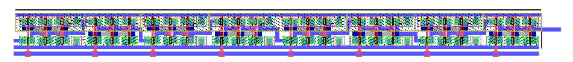
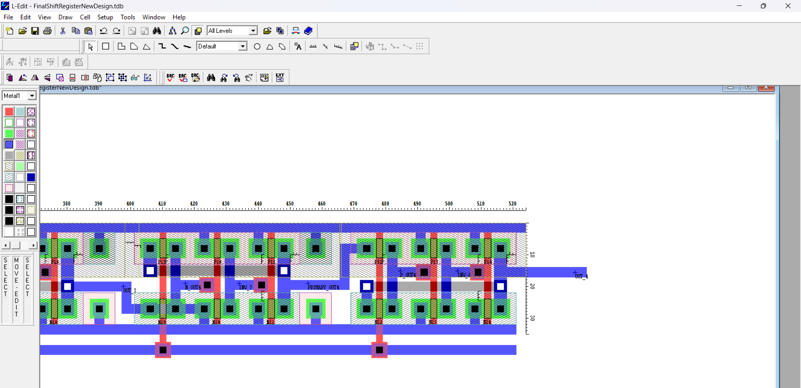
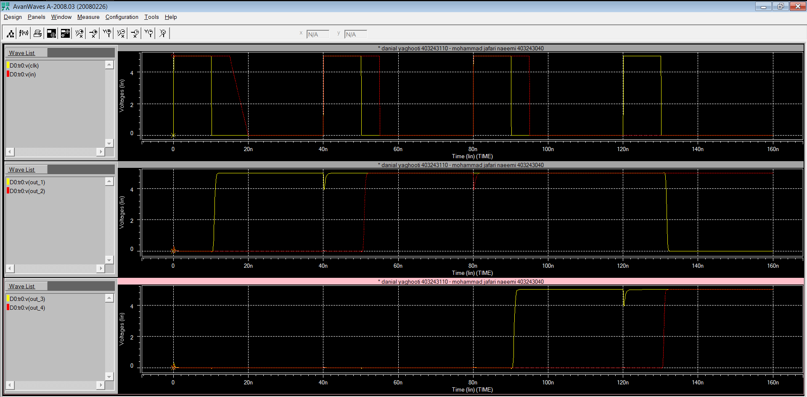

# 4-Bit Shift Register — VLSI Design

A transistor-level design and layout implementation of a **4-bit shift register**, including circuit simulation and physical layout.



## Overview 💡

This project implements a 4-bit shift register at the transistor level.

The design consists of four cascaded storage stages, where input data is shifted through the register on successive clock transitions:

```text
IN → OUT_1 → OUT_2 → OUT_3 → OUT_4
````

The project covers the complete flow from transistor-level SPICE simulation to physical layout implementation in L-Edit.




## Tools 🔨

* **L-Edit** — IC layout design
* **HSPICE** — Transient circuit simulation
* **MOSIS/ORBIT 2.0µm SCNA** — Layout technology

## Design Details

* **Architecture:** 4-bit serial shift register
* **Technology:** MOSIS/ORBIT 2.0µm SCNA
* **Supply Voltage:** 5 V
* **Transistor-level implementation:** NMOS / PMOS
* **Layout:** Custom physical layout designed in L-Edit
* **Latch-up:** Considered in the layout design
* **Simulation:** Transient analysis using HSPICE

The SPICE implementation uses MOS transistor models and includes parasitic capacitances for the different nodes of the circuit.

## Simulation

The circuit was simulated using HSPICE with a periodic clock and a pulsed input signal.

The simulation verifies the propagation of the input data through the four register stages.




## Project Files 📁

| File                            | Description                                |
| ------------------------------- | ------------------------------------------ |
| `SpiceCode.sp`                  | HSPICE transistor-level simulation netlist |
| `layout.tdb`                    | L-Edit designed layout                     |
| `LayoutExport.pdf`              | Full layout image                          |


## Result

The HSPICE transient simulation demonstrates the shifting of the input signal across the four output stages, while the L-Edit layout provides the corresponding physical implementation of the register.

---

## Authors

**[Danial Yaghooti](https://github.com/DanialYaghooti)**
**[Mohammad Jafari](jfrym743@gmail.com)**

```
```
